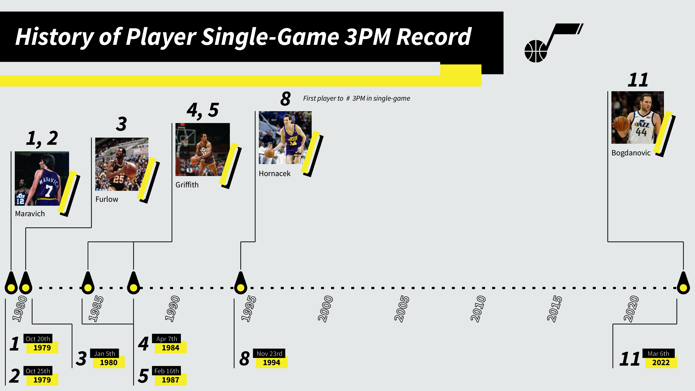

# Utah Jazz 3P Record Visual

I design a series of visuals that debuted in a recent piece on [SLC Dunk](https://www.slcdunk.com/2022/3/7/22965491/utah-jazz-3pm-record-a-history-of-the-franchise)

## Description

For a recent SLC Dunk (SB Nation affiliated Utah Jazz basketball blog), I researched the history of the single-game, individual made three-point shot record, stretching back to the debut of the rule in 1979. I collected the data and designed vizualizations to storytell the history in commemoration of the former record being broke on March 6th, 2022 by Bojan Bogdanovic.

In this repository you'll find the Adobe Illustrator file used to create the visualization and the .CSV for the raw data.

## Description

The data present in the .CSV is thanks to [Basketball Reference](https://www.basketball-reference.com/)

## Blog Post for Designing the Visualization
[Utah Jazz 3P Record](https://www.adam-bushman.com/blog_posts/blog_utah-jazz-3p-record-visual_005.html)
